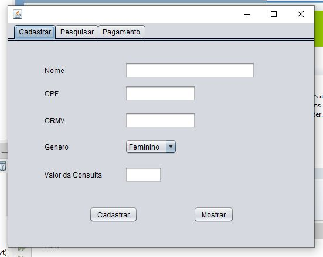
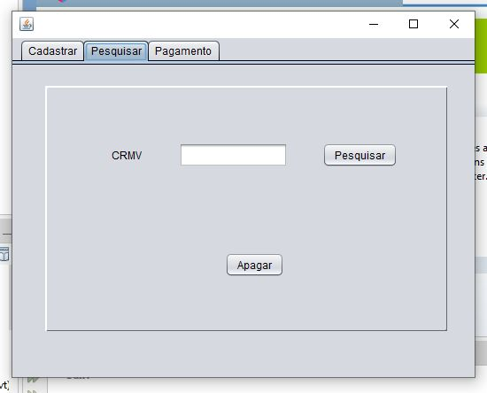
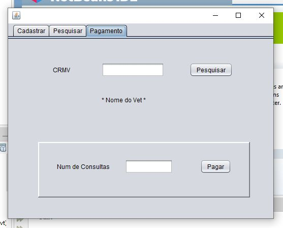

# Veterinarian Registration System

## 🔹 Project description
Desenvolvimento de um sistema em java voltado para o cadastro de veterinários e calculo de salário com base na quantidade de consultas realizadas (pode ser adaptado à outros profissionais).

Development of a Java system aimed at registering veterinarians and calculating salaries based on the number of consultations performed (can be adapted to other professionals).

## Functionalities ⚙
✔️ Cadastro. / Register.

✔️ Mostrar todos os profissionais cadastrados. / Show all registered professionals.

✔️ Pesquisar veterinário pelo CRMV e apagar seu cadastro. / Search for a veterinarian using CRMV and delete their registration.

✔️ Pesquisar veterinário pelo CRMV e mostrar o salário a receber com base no número de consultas realizadas. / Search for a veterinarian using CRMV and show the salary to be received based on the number of consultations performed.

## 📚 Languages, Dependencies and Libs 
Java, Java Swing, Developed in Apache NetBeans IDE.

## Previews

## Dev
Maria Eduarda Cardoso de Souza, meduardacardoso.121@gmail.com.

## License
The MIT License (MIT)

## Copyright ©️ 2023 - Veterinarian Registration System
